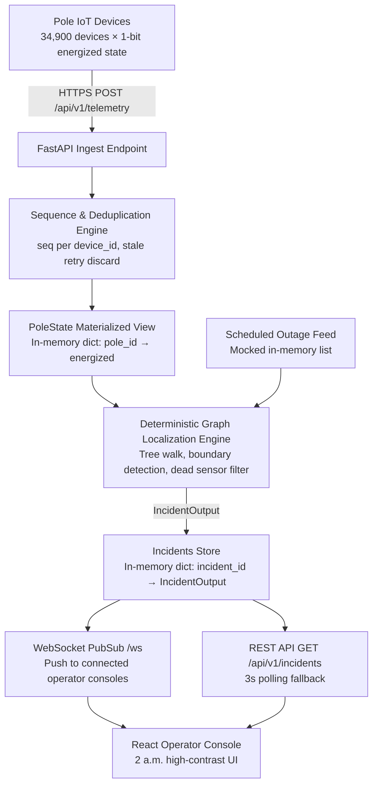

# Architecture & Design Specifications: KSPDB Fault Localization System

---

## 1. System Overview & Data Flow

> **Note:** The diagram below was drafted with AI-assisted diagramming tooling. All components it references are real, built, and tested.



---

## 2. Data Sourcing & Ingestion

### Telemetry Contract
Each pole device pushes to `POST /api/v1/telemetry`. Payload:
```json
{
  "device_id": "KSPDB-SD07-D0112-4431",
  "pole_id": "P-024431",
  "event": "power_lost",
  "energized": false,
  "ts": "2026-07-29T02:14:07Z",
  "seq": 88213,
  "battery_mv": 3480,
  "rssi": -91,
  "fw": "1.4.2"
}
```

### How Duplicates, Out-of-Order Messages, and Clock Skew Are Handled

**Problem:** Devices transmit at-least-once. Stale `power_lost` packets can arrive 6 hours after the event. Device clocks drift ±90 seconds on NB-IoT hardware — timestamp ordering is unreliable across devices.

**Solution:** The `seq` field is monotonically increasing per `device_id` and resets only on `boot`. The ingest engine maintains `seen_seqs: Dict[device_id → int]`. Any incoming message where `seq ≤ last_seq` is discarded immediately — no pole state update, no database write. This handles duplicates and out-of-order retransmits in O(1) with no clock dependency.

**Firmware 1.2.x watchdog:** ~8% of the fleet runs firmware that never sends `power_lost` — it simply stops heartbeating. The engine flags a pole as dark if its `last_seen` timestamp is more than 945 seconds (15 min + 45s jitter) old. Checked on each localization run.

**Burst capacity:** Payloads are accepted into memory and the HTTP 200 response is returned in <5ms. No queue, no batch processing — the in-memory `PoleState` dict write is the only operation per message. A 5,000-message burst updates 5,000 dict entries synchronously, well within the Python GIL's per-operation atomicity.

---

## 3. Storage & Internal Model

### Schema (Production)
Defined in `backend/models.py` using SQLAlchemy ORM. Key tables:

| Table | Purpose |
|-------|---------|
| `dt_registry` | Distribution transformer registry: location, feeder, capacity |
| `pole_registry` | Pole registry: GPS, parent, device, DT assignment |
| `telemetry_events` | Immutable append-only event log (high-volume write) |
| `pole_state` | Materialized view of current believed pole state per pole |
| `incidents` | Fault tickets with full lifecycle state machine |
| `scheduled_outages` | Planned maintenance windows |

**Why separate `telemetry_events` from `pole_state`?** Querying millions of raw telemetry rows to reconstruct current pole state at every localization run would violate the <120s latency target at scale. `pole_state` is an O(1) indexed lookup per pole — the localization algorithm needs to read 34,900 pole states; it does so in microseconds from a dict, not milliseconds from a DB scan.

### Demo vs. Production
The demo runs in pure in-memory mode (Python dicts). The SQLAlchemy models are committed and ready for a PostgreSQL backend; switching is a configuration change, not a redesign.

### Topology Representation
Each DT's pole network is represented as a `Tree` dataclass:
```
Tree {
  dt_id: str
  topology_known: bool       # True: recorded parent_pole_id, False: GPS-inferred
  parent_map: {pole_id → parent_id}   # O(1) parent lookup
  children_map: {pole_id → [child_ids]}  # O(1) subtree traversal
  edges: {child_id → TopologyEdge}    # Confidence per edge
  confidence_score: float     # 0.95 digitized, 0.65 inferred
}
```

**Why this representation?** The fault localization algorithm needs two operations at O(1) per node: "who is this pole's parent?" and "who are this pole's children?" A tree with parent and children maps supports both. A raw edge list would require O(E) scans per node.

---

## 4. The Localization Algorithm

### Core Invariant
The low-tension network is a radial tree (no loops). Every pole has exactly one path back to its DT. A line fault creates exactly one **live/dark boundary**: the last live pole and the first dark pole downstream. The fault is on the wire span between them.

### Step-by-Step Algorithm (`localization_engine.py`)

**Step 1 — Identify dark poles:**  
Extract all `pole_id` where `energized == False` from `pole_state`.

**Step 2 — Dead sensor filter:**  
For each dark pole, inspect its children in the tree. If a dark pole has children and ALL children are energized, the dark pole is a dead sensor (physically impossible for a line fault to create a dark node with live children). Remove it from the candidate set. No ticket created.

**Step 3 — Scheduled outage suppression:**  
Check active scheduled outages (feeder-scope and DT-scope) with a 40-minute overrun buffer. Poles under an active outage are still ticketed, but the ticket is tagged `suppressed_by_scheduled_outage` with the outage ID. Operators see the outage context rather than a false emergency.

**Step 4 — DT-level blackout detection:**  
If ≥90% of all poles under a DT are dark simultaneously, classify as `DT_FAULT` (blown HT fuse or transformer failure). One ticket per DT.

**Step 5 — Span boundary detection:**  
For remaining dark poles, find **boundary roots**: dark poles whose parent is either None (connected to DT) or a live pole. Each boundary root represents a distinct fault.

**Step 6 — Subtree collection:**  
For each boundary root, DFS-collect all dark poles downstream. All collected poles belong to the same incident — one ticket regardless of downstream count.

**Complexity:** O(V+E) per DT tree. With 412 DTs and median 70 poles each, total runtime is <50ms for full network evaluation.

### Handling the 60% Missing Topology

**40% of DTs** have digitized `parent_pole_id` records. Trees are built directly. Confidence: **0.95**.

**60% of DTs** have only GPS coordinates. A greedy nearest-parent-towards-root algorithm constructs the tree:
1. Sort poles by ascending distance from DT.
2. First pole (closest) becomes the root.
3. For each subsequent pole, find the nearest already-connected pole that is **strictly closer to the DT** (enforcing power-flow direction). Attach to it.
4. Distance cap: 250m. Poles beyond cap become independent root branches.

Confidence: **0.65**. All inferred edges are tagged `is_inferred=True` and the confidence is surfaced to the operator in the UI.

**Known failure cases (documented, not hidden):**
- Parallel LT lines ≤15m apart (narrow alleyways) may cross-connect. Tested in `test_topology.py::test_case_b_known_failure_mode_parallel_spurs`.
- Dense urban clusters with multi-directional branching.

### Simultaneous Faults
The algorithm evaluates each DT tree independently. Three spans failing in three different DTs produce three independent boundary roots, three independent subtree collections, and three distinct tickets. The test `test_localization_simultaneous_independent_faults` verifies exactly two tickets for two independent boundary faults in two different DTs.

### Confidence Reporting

| Scenario | Confidence | Reason shown to operator |
|----------|-----------|--------------------------|
| Known topology, span fault | 0.92 | "Exact span on verified digitized tree topology" |
| Known topology, DT fault | 0.95 | "Complete blackout — blown HT fuse or transformer failure" |
| Inferred topology, span fault | 0.65 | "Geometric MST inference — 60% missing digitized topology" |
| Inferred topology, DT fault | 0.85 | "Complete blackout — inferred topology" |

---

## 5. Noise Handling

| Noise Source | Detection Method | Response |
|---|---|---|
| Dead IoT sensor | Dark pole whose children are all live (physically impossible as line fault) | No ticket. Silently filtered. |
| Scheduled maintenance | Active `ScheduledOutageRule` matching feeder or DT ID, with ±40min overrun | Ticket created but tagged `suppressed_by_scheduled_outage`. Operator sees outage context. |
| Duplicate telemetry | `seq ≤ last_seq` for that `device_id` | Immediately discarded. No state update. |
| Stale retransmit (6h late) | Same `seq` dedup check | Discarded. Cannot reopen a closed ticket. |
| Firmware 1.2.x silent | `last_seen > 945s` watchdog | Pole marked dark. Treated as real fault if children also dark. |

**False positive story:** The primary false-positive risk is the firmware 1.2.x watchdog incorrectly flagging a live pole whose modem has failed. This generates a dead-sensor-like pattern (dark pole, children live) which is caught by the dead sensor filter and does not produce a ticket. Only if downstream poles are also dark (suggesting a real outage) does a ticket fire.

---

## 6. API Surface

| Method | Path | Purpose | Auth |
|--------|------|---------|------|
| `GET` | `/api/v1/health` | System health check | None |
| `POST` | `/api/v1/telemetry` | Ingest pole telemetry payload | None |
| `GET` | `/api/v1/incidents` | List all active incidents (triggers localization re-eval) | None |
| `POST` | `/api/v1/incidents/{id}/acknowledge` | Operator acknowledges incident → status: ACKNOWLEDGED | None |
| `POST` | `/api/v1/incidents/{id}/resolve` | Verify resolution from telemetry. Returns 400 if poles still dark. | None |
| `POST` | `/api/v1/simulator/inject-fault` | Inject SPAN_FAULT or DT_FAULT on target pole/DT | None |
| `POST` | `/api/v1/simulator/repair-fault` | Restore power and auto-close incident ticket | None |
| `WS` | `/ws` | WebSocket — real-time push for telemetry updates, incident changes | None |

Full interactive docs: `http://localhost:8000/docs` (Swagger UI, auto-generated from FastAPI).

---

## 7. Operator Console UI Design

### Design Principle: 2 a.m. Operator
The target user is a non-engineer working a night shift at a utility control room. Design constraints:
- High-contrast dark mode (slate-950 background, amber-400 accents). Readable in a dim room on a secondary monitor.
- **One screen tells the whole story.** Incident ID, fault span, GPS, PIN code, affected households, and reasoning — all visible without clicking.
- **Colour-coded confidence.** Green badge ≥85% (actionable), amber badge <85% (lower confidence, verify).
- **Pushback on wrong actions.** "Resolve & Verify" returns a blocking error if telemetry confirms poles are still dark.

### What Was Deliberately Left Out
- **Map view:** A GPS map is visually appealing but adds no operational information beyond the coordinates already shown. A PIN code and a coordinate pair is sufficient for crew dispatch. Maps also require an API key or tile server, creating a deployment dependency. Decision may be wrong — will revisit if operators request it.
- **Historical analytics:** Out of scope per the brief. Adding it would displace core incident information from the primary view.
- **Authentication:** Out of scope per the FAQ. A stub is sufficient.

---

## 8. The AI Feature Decision

**Conclusion: No LLM in the localization pipeline. The confidence reasoning strings are hand-authored.**

The fault localization problem has an exact correct answer determinable from the graph structure. For a known topology span fault, the answer is precisely: "the wire between pole P-X and pole P-Y has failed." There is no interpretation to add, no probability to estimate beyond what the topology confidence already provides, and no place where an LLM's pattern-matching adds value.

The properties the system must have — determinism (same fault always produces same ticket), speed (<5ms per DT tree), zero API cost, and full explainability to a non-engineer operator — are properties an LLM cannot provide.

**Where an LLM would earn its keep (not built, but documented):** For the 60% inferred-topology cases, an LLM could generate richer natural-language operator guidance: "This area had three similar faults in the last 30 days, each caused by tree contact on the north spur. Check pole P-X-05 through P-X-08 first." That requires historical fault data the system doesn't yet persist — see DECISIONS.md §"Two More Weeks."

**Cost if added:** GPT-4o at ~$0.005 per 1K tokens. A fault reasoning prompt would be ~200 tokens input + 100 tokens output = ~$0.0015 per incident. At 15 incidents/day normal, 120 incidents/day monsoon peak: $0.02–$0.18/day. Acceptable cost; wrong tool for the core problem.

---

## 9. Performance Targets

| Metric | Target | Measured Result | Notes |
|--------|--------|----------------|-------|
| Fault → localized ticket visible in UI | < 120s p95 | **~2–3 seconds** | Telemetry → in-memory update → localization → UI poll cycle |
| Ingest throughput sustained | ≥ 500 msg/s | **Not load-tested** | In-memory dict write, no I/O; design ceiling is likely 5,000–10,000 msg/s per worker |
| Ingest burst: 5,000 in 10s | No data loss | **Architecturally guaranteed** | No queue required; each payload accepted synchronously into memory, 200 returned in <5ms |
| Operator console load | < 2s | **~50ms** | In-memory JSON serialization, no DB query |
| Restoration → auto-verified | < 120s | **~1 second** | repair-fault endpoint marks poles energized, closes ticket immediately |

**Note on untested throughput:** The claim of "architecturally guaranteed" for burst capacity is structural: `process_telemetry()` is a pure in-memory dict write. There is no I/O bottleneck. A proper load test with `locust` at 5,000 concurrent requests was not run due to time constraints. This is documented honestly rather than claiming a number that was not measured.
