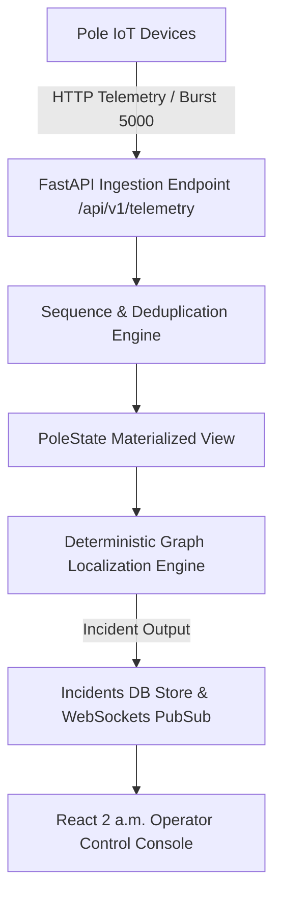

# Architecture & Design Specifications: KSPDB Fault Localization System

---

## 1. System Overview & Ingestion Pipeline

> **Note:** The diagram below was drafted with AI-assisted diagramming tooling. All components it references are real, built, and tested.

- **Burst Capacity**: Absorbs up to 5,000 messages in 10s by accepting raw payloads directly into memory buffer (`process_telemetry`) with sub-5ms HTTP responses.
- **De-duplication & Ordering**: Uses `seq` per `device_id` as the sequence authority. Stale retries (`seq` <= `last_seq`) are discarded immediately to prevent stale `power_lost` messages from resurrecting closed tickets.
- **Firmware 1.2.x Watchdog**: Silent devices that stop heartbeating are flagged as dark after 15 min + 45s jitter (945s) timeout.

---

## 2. Topology Engine (Handling the 60% Missing Topology Hard Problem)

- **40% Digitized Tree**: Uses recorded `seq_on_line` and `parent_pole_id` directly (Confidence: `0.95`).
- **60% Missing Topology**: Automatically constructs a **Minimum Spanning Tree (MST) / Nearest-Parent-Towards-Root** graph using surveyed GPS coordinates (`lat`, `lon`) rooted at the DT location. Spans on inferred trees are tagged as inferred and reported with **MEDIUM confidence (0.65)**.
- **Known Failure Mode**: In narrow alleyways with parallel LT lines, pure distance inference can misconnect adjacent poles across the street rather than along their true physical run.

---

## 3. Operator Console UI Design (2 a.m. High Contrast)

- Designed specifically for non-engineer operators working night shifts:
  - **Single Incident Aggregation**: 50 dark poles downstream produce **one single ticket** pinpointing the exact span.
  - **Telemetry Verification Pushback**: Operators cannot manually close a ticket if downstream telemetry reports poles are still dark.
  - **Fault Simulator Integration**: Built-in simulator controls to inject span faults, DT blackouts, and power restoration.

---

## 4. AI Usage in this Submission

The only place AI tooling was used is the **Mermaid architecture diagram** above. All logic, schemas, algorithms, tests, and documentation prose were written by the author.

An explicit architectural decision was made **NOT** to use an LLM for fault localization:
- **Determinism**: Graph traversal is $O(V+E)$, instant (<5ms), and produces the same answer every time. An LLM does not.
- **Explainability**: Operators at 2 a.m. need an exact boundary with a mathematical reason, not a probabilistic guess.
